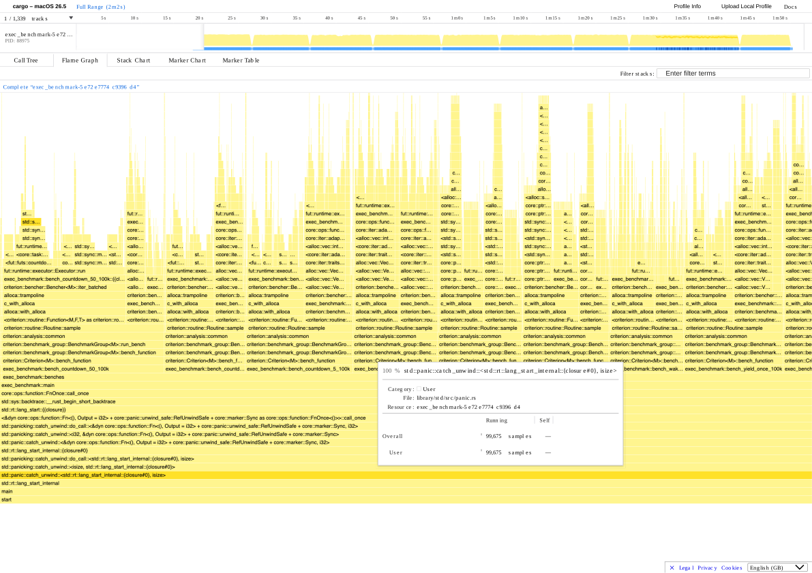

# Custom Async Runtime Benchmarks — Week 1 Baseline

> Rust async executor built from scratch (no Tokio/async-std). Criterion.rs 0.8.2, Apple M2, release build.

## Quick Numbers

| Metric | Result |
|--------|--------|
| Spawn throughput | ~23.8M tasks/sec (42 ns/task) |
| Yield round-trip | ~46 ns |
| Marginal poll cost | ~26 ns/poll |
| Wake latency | 373 ns |
| Scaling (10k → 100k tasks) | 97.8%–99.9% linear |

## Architecture

Single-threaded cooperative executor using only `std`. Three core components: `Task`, `Executor`, and hand-rolled `RawWaker`.

```
spawn(future) → Box::pin → Arc<Task> → send to mpsc queue
poll_loop() → recv → lock Mutex → poll → Ready: drop | Pending: wake() → re-enqueue
```

### Task

```rust
pub struct Task {
    pub future: Mutex<Pin<Box<dyn Future<Output = ()> + Send>>>,
    pub sender: Sender<Arc<Task>>,
}
```

- `Pin<Box<dyn Future>>` — heap-allocated, immovable future
- `Mutex` — mutable access during polling (unnecessary overhead since executor is single-threaded)
- `sender` — used by waker to re-enqueue task on `wake()`

### Executor

```rust
pub struct Executor {
    sender: Sender<Arc<Task>>,
    receiver: Receiver<Arc<Task>>,
}
```

- `spawn()` — wraps future in `Arc<Task>`, pushes to queue
- `run()` — receives task, builds waker, polls future

### RawWaker VTable

| Method | What it does |
|--------|-------------|
| `clone` | `Arc::clone` the task, return new `RawWaker` |
| `wake` | `Arc::from_raw` → `send(task)` — consumes waker |
| `wake_by_ref` | `Arc::from_raw` → `clone` → `send` → `mem::forget` — keeps waker alive |
| `drop` | `Arc::from_raw` → drop — balances the `into_raw` from creation |

**Key invariant:** every `Arc::from_raw` must be balanced by exactly one of `into_raw` / `mem::forget` / `drop`. Violations = memory leaks or use-after-free.

### Current Limitations

- Single-threaded, no work stealing
- No timers, no sleep, no I/O reactor
- No task priorities, no cancellation
- `std::sync::mpsc` for queue (overkill for SPSC)
- `Mutex` on every future (unnecessary atomic barriers)

## Raw Results

| Benchmark | 10k tasks | 100k tasks | Polls/task |
|-----------|-----------|------------|------------|
| `spawn` | 419 µs | 4.20 ms | 1 |
| `yield_once` | 881 µs | 8.86 ms | 2 |
| `countdown_5` | 1.89 ms | 19.0 ms | 6 |
| `countdown_50` | 13.4 ms | 137 ms | 51 |
| `wake_latency` | 373 ns | — | 1 call |

## Per-Task Latency

| Benchmark | 10k tasks | 100k tasks |
|-----------|-----------|------------|
| `spawn` | 41.93 ns | 41.97 ns |
| `yield_once` | 88.13 ns | 88.61 ns |
| `countdown_5` | 189.0 ns | 190.1 ns |
| `countdown_50` | 1,343.9 ns | 1,373.5 ns |

## Per-Poll Latency

| Benchmark | Polls/task | 10k tasks | 100k tasks |
|-----------|------------|-----------|------------|
| `spawn` | 1 | 41.93 ns | 41.97 ns |
| `yield_once` | 2 | 44.07 ns | 44.31 ns |
| `countdown_5` | 6 | 31.50 ns | 31.68 ns |
| `countdown_50` | 51 | 26.35 ns | 26.93 ns |

Per-poll cost goes *down* as poll depth goes up because spawn allocation gets spread across more polls.

## Yield Round-Trip Overhead

```
per_task(yield_once) - per_task(spawn)

10k:  88.13 ns - 41.93 ns = 46.20 ns
100k: 88.61 ns - 41.97 ns = 46.64 ns
```

~46 ns per yield. Includes one `wake()`, one `mpsc::send`, and one re-poll.

## Marginal Poll Cost

```
Δpolls = 51 - 6 = 45
Δtime (10k) = 1343.9 ns - 189.0 ns = 1154.9 ns

Marginal poll ≈ 1154.9 / 45 ≈ 25.7 ns/poll
```

~25.7 ns per extra `Pending` poll once a task is already live.

## Scaling Analysis

| Benchmark | 10k | 100k | Predicted | Actual/Predicted | Efficiency |
|-----------|-----|------|-----------|------------------|------------|
| `spawn` | 419 µs | 4.197 ms | 4.193 ms | 1.001× | 99.9% |
| `yield_once` | 881 µs | 8.861 ms | 8.813 ms | 1.005× | 99.5% |
| `countdown_5` | 1.89 ms | 19.006 ms | 18.900 ms | 1.006× | 99.4% |
| `countdown_50` | 13.439 ms | 137.35 ms | 134.39 ms | 1.022× | 97.8% |

Essentially linear. `countdown_50` drifts 2.2% at 100k — probably L2 cache pressure at 5.1M total polls.

## Throughput

### Tasks/sec

| Benchmark | 10k tasks | 100k tasks |
|-----------|-----------|------------|
| `spawn` | 23.85 M | 23.83 M |
| `yield_once` | 11.35 M | 11.29 M |
| `countdown_5` | 5.29 M | 5.26 M |
| `countdown_50` | 0.744 M | 0.728 M |

### Polls/sec (100k tasks)

| Benchmark | Total Polls | Time | Polls/sec |
|-----------|-------------|------|-----------|
| `spawn` | 100,000 | 4.197 ms | 23.83 M |
| `yield_once` | 200,000 | 8.861 ms | 22.57 M |
| `countdown_5` | 600,000 | 19.006 ms | 31.57 M |
| `countdown_50` | 5,100,000 | 137.35 ms | 37.13 M |

Poll throughput actually *improves* with more polls per task. Inner loop is tight — bottleneck is the `Mutex` on every iteration.

## Wake Latency Breakdown

| Component | Estimate |
|-----------|----------|
| Total wake latency | 373.15 ns |
| `mpsc::send` | ~200–250 ns |
| RawWaker vtable dispatch | ~100–130 ns |
| `Arc` clone / refcount | ~30–50 ns |

373 ns is the floor for scheduling latency. The ~46 ns yield round-trip is lower because the executor loop pipelines some overhead.

## Flamegraph



Profile: macOS sampler, 99,675 samples over ~2 min (`exec_benchmark` PID 88975). Open in [Firefox Profiler](https://profiler.firefox.com) for interactive view.

**Hot stacks:**
- `alloca` / `c_with_alloca` — allocator hit on every spawn (`Box::pin` + `Arc` = 2 heap allocs per task)
- `std::sync::mpsc` + `std::sync` — `Mutex::lock` + channel send/recv eating significant per-poll budget
- `dyn core::ops::function::FnOnce` — `Box<dyn Future>` vtable dispatch visible on every poll
- `alloc::vec::Vec` — task storage growing as 100k tasks get created

**Key takeaway:** Allocation and locking dominate. Executor loop itself is reasonably tight.

## Caveats

- **Synthetic workloads only** — no I/O, no real network traffic, no allocation inside futures
- **Single-threaded** — multithreading has totally different bottlenecks (cache coherency, contention)
- **Battery power** — M2 was unplugged. Probably 5–15% slower than AC power.
- **Warm allocator** — Criterion pre-heats the heap. Cold starts will be worse.
- **No tail latency** — only means reported. p99 matters for I/O but we don't have it yet.
- **Mutex never contended** — clean scaling won't carry over to multi-threaded version.

## Formulas Used

```
per_task  = total_time / N
per_poll  = total_time / (N × polls_per_task)
task_throughput = N / total_time
poll_throughput = (N × polls_per_task) / total_time
scaling_eff = (time_10k × 10) / time_100k
yield_overhead = per_task(yield_once) - per_task(spawn)
marginal_poll = Δper_task / Δpolls_per_task
```

*Week 1 baseline · Apple M2 · aarch64-apple-darwin · rustc stable · release build*
